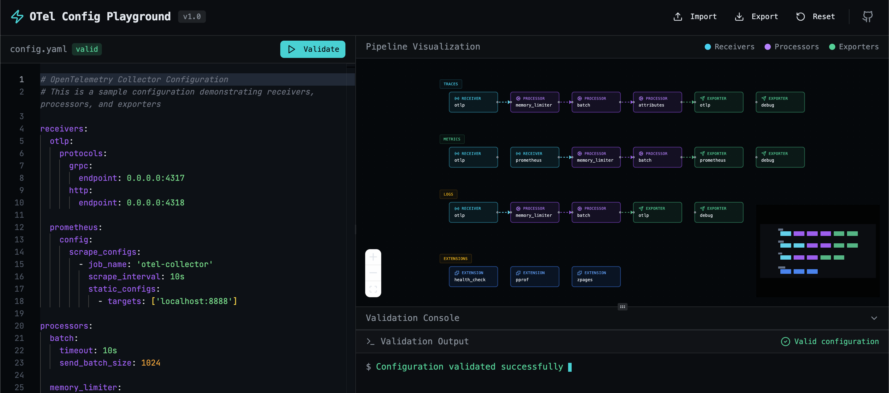

# OpenTelemetry Config Playground

A web-based playground for testing and visualizing OpenTelemetry Collector configurations. Paste your YAML config, see the pipeline visualization, and get instant validation feedback with error highlighting.



## Features

- **Pipeline Visualization**: Interactive flow diagram showing receivers → processors → exporters
- **Real-time Validation**: Instant feedback on configuration errors and warnings
- **Error Highlighting**: Click on errors to jump to the relevant line in the editor
- **Import/Export**: Load and save configuration files
- **Dark Theme**: Developer-friendly terminal aesthetic

## Quick Start

### Local Development

```bash
# Install dependencies
pnpm install

# Start development server
pnpm dev

# Build for production
pnpm build

# Start production server
pnpm start
```

### Docker

```bash
# Build the image
docker build -t otel-config-playground .

# Run the container
docker run -p 3000:3000 otel-config-playground
```

### Kubernetes Deployment

```bash
# Apply all manifests using kustomize
kubectl apply -k k8s/

# Or apply individually
kubectl apply -f k8s/namespace.yaml
kubectl apply -f k8s/deployment.yaml
kubectl apply -f k8s/service.yaml
kubectl apply -f k8s/ingress.yaml
kubectl apply -f k8s/hpa.yaml
```

## Configuration

### Environment Variables

| Variable | Description | Default |
|----------|-------------|---------|
| `PORT` | Server port | `3000` |
| `NODE_ENV` | Environment mode | `development` |

### Kubernetes Configuration

Update the following files before deployment:

1. **`k8s/ingress.yaml`**: Set your domain name and TLS configuration
2. **`k8s/kustomization.yaml`**: Update the container image registry path

## Architecture

```
┌─────────────────────────────────────────────────────────────┐
│                    OTel Config Playground                    │
├─────────────────────┬───────────────────────────────────────┤
│                     │                                       │
│   YAML Editor       │   Pipeline Visualization              │
│                     │   (React Flow)                        │
│                     │                                       │
│   ┌─────────────┐   │   ┌─────┐   ┌─────┐   ┌─────┐        │
│   │ receivers:  │   │   │ RCV │──▶│ PRC │──▶│ EXP │        │
│   │   otlp:     │   │   └─────┘   └─────┘   └─────┘        │
│   │ processors: │   │                                       │
│   │   batch:    │   │   ┌─────┐   ┌─────┐   ┌─────┐        │
│   │ exporters:  │   │   │ RCV │──▶│ PRC │──▶│ EXP │        │
│   │   debug:    │   │   └─────┘   └─────┘   └─────┘        │
│   └─────────────┘   │                                       │
│                     │                                       │
├─────────────────────┴───────────────────────────────────────┤
│                    Validation Console                        │
│   $ Configuration validated successfully ▋                   │
└─────────────────────────────────────────────────────────────┘
```

## Validation Rules

The playground validates:

- **Syntax**: YAML parsing errors with line numbers
- **References**: Undefined receivers, processors, or exporters in pipelines
- **Completeness**: Missing service section, empty pipelines
- **Unused Components**: Warnings for defined but unused components
- **Extensions**: Validation of enabled extensions

## Tech Stack

- **Frontend**: React 19, TypeScript, Tailwind CSS 4
- **Visualization**: React Flow
- **YAML Parsing**: yaml (js-yaml alternative)
- **Build**: Vite
- **Runtime**: Node.js 22

## Project Structure

```
otel-config-playground/
├── client/
│   ├── src/
│   │   ├── components/
│   │   │   ├── ErrorConsole.tsx      # Validation output display
│   │   │   ├── PipelineNode.tsx      # Flow diagram nodes
│   │   │   └── PipelineVisualization.tsx
│   │   ├── lib/
│   │   │   └── otel-parser.ts        # YAML parsing & validation
│   │   └── pages/
│   │       └── Home.tsx              # Main application page
│   └── index.html
├── k8s/
│   ├── deployment.yaml
│   ├── service.yaml
│   ├── ingress.yaml
│   ├── hpa.yaml
│   ├── namespace.yaml
│   └── kustomization.yaml
├── Dockerfile
├── package.json
└── README.md
```


## Next steps:

1- Add connector support: Extend the parser to visualize connectors that link pipelines together (e.g., forward connector, count connector )

2- Add config templates: Include a dropdown with common OTel configurations (Jaeger, Prometheus, OTLP) for quick starting points


## Contributing

1. Fork the repository
2. Create a feature branch
3. Make your changes
4. Submit a pull request

## License

MIT License - see [LICENSE](LICENSE) for details.

## Related Resources

- [OpenTelemetry Collector Documentation](https://opentelemetry.io/docs/collector/)
- [Collector Configuration Reference](https://opentelemetry.io/docs/collector/configuration/)
- [OpenTelemetry Collector Contrib](https://github.com/open-telemetry/opentelemetry-collector-contrib)
