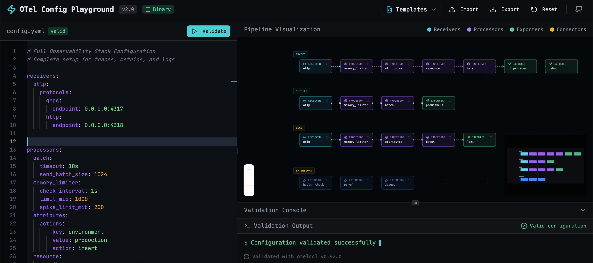

# OpenTelemetry Config Playground

A web-based playground for testing and visualizing OpenTelemetry Collector configurations. Paste your YAML config, see the pipeline visualization, and get real-time validation with error highlighting.




## Features

- **Monaco Editor** - Full-featured YAML editor with syntax highlighting
- **Pipeline Visualization** - Interactive diagram showing data flow from receivers through processors to exporters
- **Real-time Validation** - Instant feedback as you type with error highlighting
- **Binary Validation** - Uses the actual `otelcol` binary for production-grade validation (when available)
- **Error Navigation** - Click on errors to jump to the relevant line in the editor
- **Import/Export** - Load and save your configurations
- **Dark Theme** - Terminal/CLI aesthetic designed for DevOps workflows

## Validation Modes

The playground supports two validation modes:

| Mode | Description | Accuracy |
|------|-------------|----------|
| **Binary** | Uses the `otelcol` binary for validation | Full component validation |
| **Fallback** | Client-side structural validation | Basic reference checking |

When running in Docker with the otelcol binary included, you get full validation including:
- Component-specific configuration validation
- Endpoint format validation
- TLS configuration validation
- All receiver/processor/exporter options

## Quick Start

### Local Development

```bash
# Clone the repository
git clone https://github.com/akria18/opentelemetry-playground.git
cd opentelemetry-playground

# Install dependencies
pnpm install

# Start development server
pnpm dev
```

### Docker

```bash
# Build the image (includes otelcol binary)
docker build -t otel-config-playground .

# Run the container
docker run -p 3000:3000 otel-config-playground
```

### Kubernetes

```bash
# Apply all manifests
kubectl apply -k k8s/

# Or apply individually
kubectl apply -f k8s/namespace.yaml
kubectl apply -f k8s/deployment.yaml
kubectl apply -f k8s/service.yaml
kubectl apply -f k8s/ingress.yaml
```

## Architecture

```
┌─────────────────────────────────────────────────────────────┐
│                    OTel Config Playground                    │
├─────────────────────┬───────────────────────────────────────┤
│                     │                                       │
│   YAML Editor       │   Pipeline Visualization              │
│   (Monaco)          │   (React Flow)                        │
│                     │                                       │
│   ┌─────────────┐   │   ┌─────┐   ┌─────┐   ┌─────┐        │
│   │ receivers:  │   │   │ RCV │──▶│ PRC │──▶│ EXP │        │
│   │   otlp:     │   │   └─────┘   └─────┘   └─────┘        │
│   │ processors: │   │                                       │
│   │   batch:    │   │   ┌─────┐   ┌─────┐   ┌─────┐        │
│   │ exporters:  │   │   │ RCV │──▶│ PRC │──▶│ EXP │        │
│   │   debug:    │   │   └─────┘   └─────┘   └─────┘        │
│   └─────────────┘   │                                       │
│                     │                                       │
├─────────────────────┴───────────────────────────────────────┤
│                    Validation Console                        │
│   $ Configuration validated successfully ▋                   │
└─────────────────────────────────────────────────────────────┘
```

## Project Structure

```
├── client/                 # Frontend React application
│   ├── src/
│   │   ├── components/     # React components
│   │   ├── hooks/          # Custom hooks (useOtelValidation)
│   │   ├── lib/            # Utilities (otel-parser)
│   │   └── pages/          # Page components
│   └── index.html
├── server/                 # Backend Express server
│   ├── otel-validator.ts   # Binary validation service
│   ├── routers.ts          # tRPC API routes
│   └── *.test.ts           # Vitest tests
├── k8s/                    # Kubernetes manifests
│   ├── deployment.yaml
│   ├── service.yaml
│   ├── ingress.yaml
│   ├── hpa.yaml
│   └── kustomization.yaml
├── Dockerfile              # Multi-stage build with otelcol
└── README.md
```

## API Endpoints

The backend provides tRPC endpoints for validation:

```typescript
// Validate configuration
trpc.otel.validate.mutate({ config: yamlString })
// Returns: { isValid: boolean, errors: ValidationError[], binaryVersion?: string }

// Check validation status
trpc.otel.status.query()
// Returns: { binaryAvailable: boolean, binaryVersion: string, validationMode: string }
```

## Configuration Example

```yaml
receivers:
  otlp:
    protocols:
      grpc:
        endpoint: 0.0.0.0:4317
      http:
        endpoint: 0.0.0.0:4318

processors:
  batch:
    timeout: 10s
    send_batch_size: 1024
  memory_limiter:
    check_interval: 1s
    limit_mib: 1000

exporters:
  otlp:
    endpoint: otelcol:4317
  debug:
    verbosity: detailed

service:
  pipelines:
    traces:
      receivers: [otlp]
      processors: [memory_limiter, batch]
      exporters: [otlp, debug]
```

## Validation Rules

The playground validates:

- **Syntax**: YAML parsing errors with line numbers
- **References**: Undefined receivers, processors, or exporters in pipelines
- **Completeness**: Missing service section, empty pipelines
- **Unused Components**: Warnings for defined but unused components
- **Extensions**: Validation of enabled extensions
- **Binary Mode**: Full component-specific validation (when otelcol available)

## Environment Variables

| Variable | Description | Default |
|----------|-------------|---------|
| `PORT` | Server port | `3000` |
| `NODE_ENV` | Environment | `development` |
| `OTELCOL_PATH` | Path to otelcol binary | `otelcol` |

## Technology Stack

- **Frontend**: React 19, TypeScript, Tailwind CSS 4, Monaco Editor, React Flow
- **Backend**: Node.js, Express, tRPC
- **Validation**: otelcol-contrib binary
- **Testing**: Vitest
- **Deployment**: Docker, Kubernetes

## Release Management

This project uses automated release management with:

- **[Conventional Commits](https://www.conventionalcommits.org/)** - Standardized commit messages
- **[Release Please](https://github.com/googleapis/release-please)** - Automated versioning and changelog
- **GitHub Actions** - CI/CD for testing, building, and publishing

### Creating a Release

1. Merge PRs to `main` using conventional commit messages
2. Release Please automatically creates a Release PR
3. Merge the Release PR to trigger:
   - GitHub Release creation
   - Docker image build and push to GHCR
   - Changelog update

### Docker Images

Docker images are published to GitHub Container Registry:

```bash
# Pull the latest version
docker pull ghcr.io/akria18/opentelemetry-playground:latest

# Pull a specific version
docker pull ghcr.io/akria18/opentelemetry-playground:1.0.0
```

### Commit Convention

| Type | Description | Version Bump |
|------|-------------|---------------|
| `feat` | New feature | Minor |
| `fix` | Bug fix | Patch |
| `feat!` | Breaking change | Major |
| `docs` | Documentation | None |
| `chore` | Maintenance | None |

See [CONTRIBUTING.md](CONTRIBUTING.md) for detailed guidelines.


## Contributing

1. Fork the repository
2. Create a feature branch (`git checkout -b feature/amazing-feature`)
3. Commit your changes (`git commit -m 'Add amazing feature'`)
4. Push to the branch (`git push origin feature/amazing-feature`)
5. Open a Pull Request

## License

MIT License - see [LICENSE](LICENSE) for details.

## Related Resources

- [OpenTelemetry Collector Documentation](https://opentelemetry.io/docs/collector/)
- [Collector Configuration Reference](https://opentelemetry.io/docs/collector/configuration/)
- [OpenTelemetry Collector Contrib](https://github.com/open-telemetry/opentelemetry-collector-contrib)
